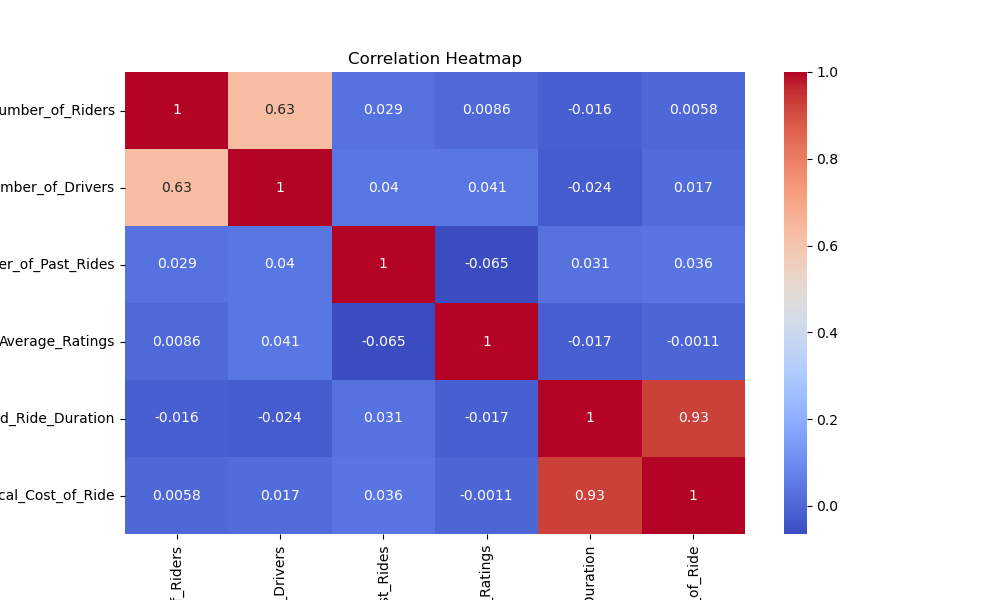
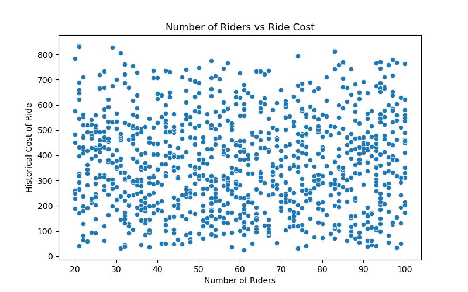
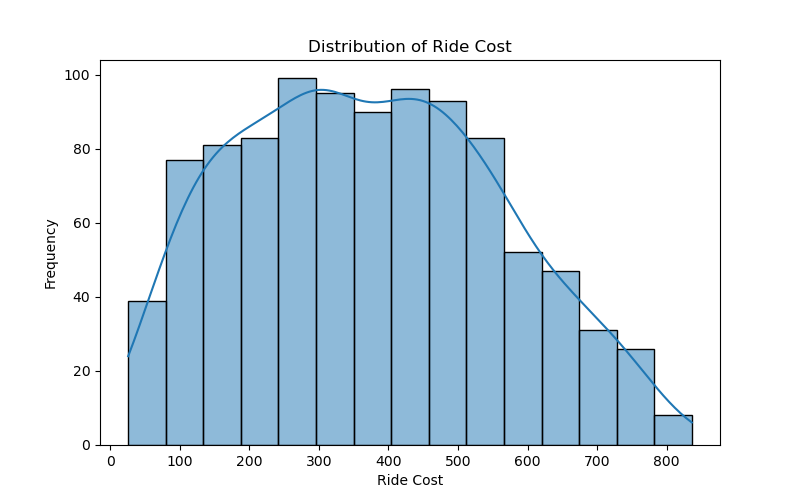

# Dynamic Ride Pricing System

An end-to-end Machine Learning project that predicts ride prices dynamically based on rider demand, driver availability, ride duration, booking patterns, and customer behavior.

The project simulates how ride-hailing platforms optimize pricing using data-driven decision making.

---

## Project Objective

The objective of this project is to build a pricing prediction system capable of:

- analyzing rider demand and driver availability
- identifying factors affecting ride prices
- predicting ride fares using Machine Learning
- generating insights through data visualization

---

## Business Problem

Ride-hailing companies face challenges in balancing rider demand, driver availability, revenue optimization, and customer satisfaction.

Static pricing often leads to:
- inefficient driver allocation
- revenue loss
- poor customer experience

This project uses Machine Learning to simulate a dynamic pricing strategy similar to real-world ride aggregation platforms.

---

## Project Structure

```text
Dynamic Pricing Project/

├── dataset/
│   └── dynamic_pricing.csv
│
├── notebook/
│
├── reports/
│
├── src/
│   └── dynamic_pricing.py
│
├── visuals/
│   ├── heatmap.png
│   ├── riders_vs_cost.png
│   ├── drivers_vs_cost.png
│   ├── ride_cost_distribution.png
│   ├── vehicle_type_vs_cost.png
│   └── time_vs_cost.png
│
├── README.md
├── requirements.txt
└── .gitignore
```

---

## Exploratory Data Analysis

The project includes analysis and visualizations for:

- ride cost distribution
- rider demand vs pricing
- driver availability vs pricing
- vehicle type pricing
- booking time pricing trends
- correlation heatmap

All generated visualizations are automatically saved inside the `visuals/` folder.

---

## Machine Learning Models Used

### Linear Regression
Used to predict ride prices using relationships between variables.

### Random Forest Regressor
Used to capture non-linear pricing patterns and feature interactions.

---

## Model Performance

| Model | R² Score | MAE |
|------|------|------|
| Linear Regression | ~0.87 | ~52 |
| Random Forest Regressor | ~0.85 | ~55 |

### Best Performing Model
Linear Regression

The results indicate that ride pricing in the dataset follows relatively interpretable patterns influenced by:
- ride duration
- rider demand
- driver availability
- booking conditions

---

## Dynamic Price Prediction

The system predicts ride prices dynamically for new ride conditions.

### Example Output

```text
Recommended Dynamic Ride Price:
461.19
```

---

## Tech Stack

- Python
- Pandas
- NumPy
- Matplotlib
- Seaborn
- Scikit-learn

---

## How to Run

### 1. Install required libraries

```bash
pip install -r requirements.txt
```

### 2. Navigate to the src folder

```bash
cd src
```

### 3. Run the project

```bash
python dynamic_pricing.py
```

---

## Key Features

- End-to-end ML pipeline
- Business-oriented pricing system
- Automated visualization generation
- Dynamic ride fare prediction
- Clean project structure
- Multiple ML model comparison

---

## Sample Visualizations

### Correlation Heatmap



### Riders vs Ride Cost



### Ride Cost Distribution



---

## Future Improvements

- Streamlit deployment
- Real-time pricing integration
- Advanced ensemble models
- Power BI dashboard
- Demand forecasting
- Surge pricing simulation

---

## Author

**Avdhut Kolhe**

GitHub:  
https://github.com/AvdhutKolhe22